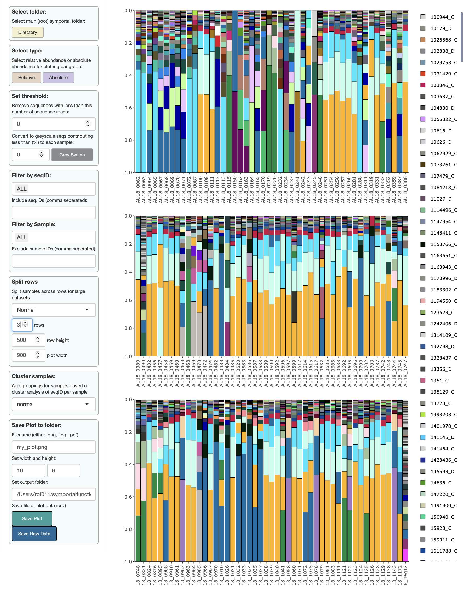
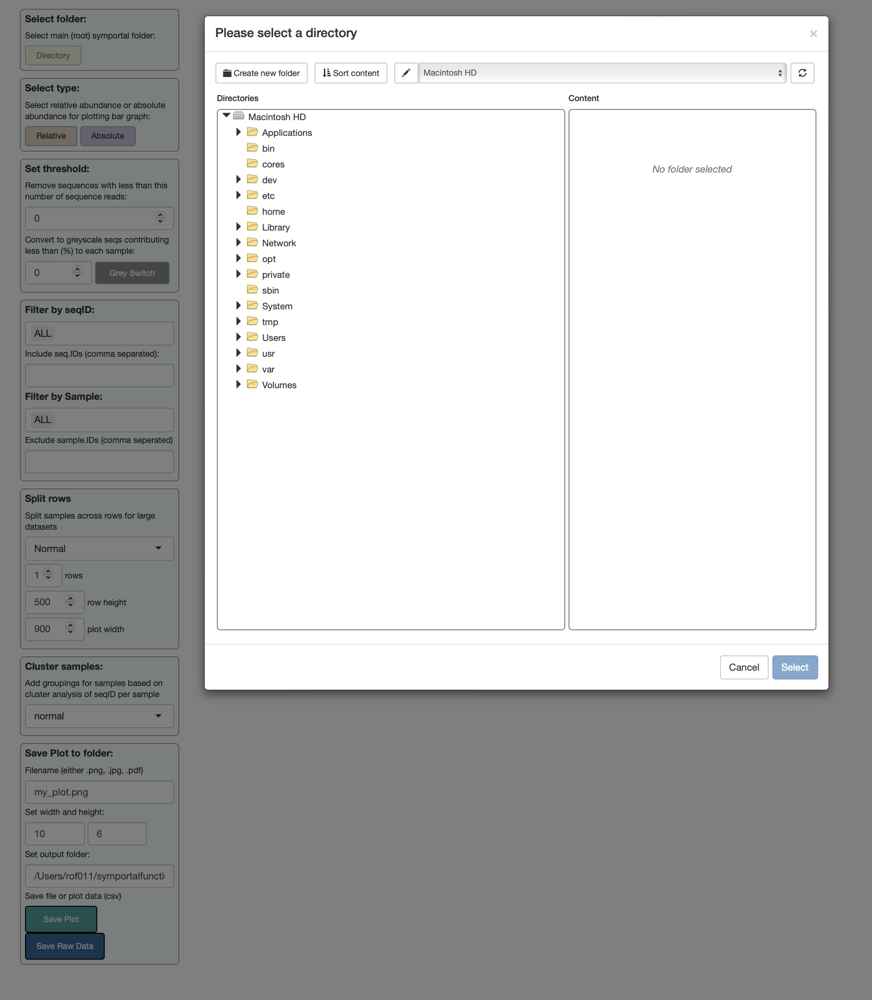

```{r setup, include=FALSE}
knitr::opts_chunk$set(echo = TRUE)
```

symbioR includes a shiny app that can better visualise the ITS2 community outputs from [symportal](http://symportal.org). The shiny viewer allows:

-   uploading sequences via "select folder" for simple use

-   `pplotly` to interact with plots to reveal rare seqID types

-   visualisation of `relative` vs `absolute` sequence abundances

-   setting thresholds to remove rare sequences

-   setting thresholds to "ghost" rare sequences and enhance visualisation

-   filtering of plots by `seqID`

-   filtering of plots by `sample_name`

-   splitting large datasets across multiple rows

-   ordering samples by hierarchical clustering of sequences (`bray-curtis`, `jaccard`, `euclidian`, `hellinger`)

-   saving plots to `png`, `jpg`, `pdf` formats



To run the `shiny` viewer, either call the sequence folder inline:

```{r, include=FALSE}
devtools::load_all()
library(tidyverse)
library(symbioR)


set.seed(1)

folder_path <- ("/Users/rof011/symbiodinium/20230120T102936_esampayo")
```

```{r, include=TRUE, eval=FALSE}
library(tidyverse)
library(symbioR)


set.seed(1)

folder_path <- ("/Users/rof011/symbiodinium/20230120T102936_esampayo")


view_sequences(folder_path)

```

Or call `view_sequences()` with an empty plot and upload the folder using the folder window:



```{r, include=TRUE, eval=FALSE}
library(tidyverse)
library(symbioR)


set.seed(1)

folder_path <- ("/Users/rof011/symbiodinium/20230120T102936_esampayo")


view_sequences(folder_path)

```
